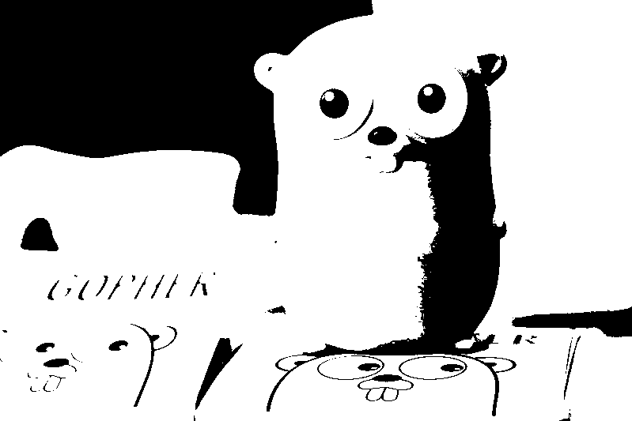

# Mergi

For now, this runs an api to apply some effects to images

## Running Server

Make sure you have already installed [golang](https://golang.org/doc/install);

Run:

    $ go mod vendor
    $ go run .

## Effects

The available effects available in the API are:

To get the result image, send the original image as form file to one of the following endpoints. replace `api` by `localhost:1212` or the host you are using.

|   Drawing - api/applyDW   |  Pixelate - api/applyPX   |
| :-----------------------: | :-----------------------: |
|  |  |

| Gray Scale - api/applyGS  |Black & White - api/applyBW|
| :-----------------------: | :-----------------------: |
|  |  |
